# 模型缓存策略详解

> 从 Transformer 的注意力机制出发，逐层推导 KV Cache 和 Prompt Cache 的工作原理。本文不是概念罗列，而是一条完整的推理链：理解了前一步，后一步自然成立。

::: tip 本文目标
读完后你将理解：输入一段话，模型内部发生了什么？缓存存了什么、何时命中、何时失效？作为开发者如何利用缓存降本提速？
:::

---

## 一、全景概览：缓存到底在加速什么？

大语言模型在生成文本时，每输出一个字都需要"回顾"前面所有内容。如果每次都从头算，成本会随对话长度**平方级增长**。缓存就是为了解决这个问题。

目前有两层缓存机制：

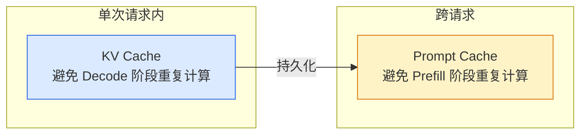

| 缓存类型 | 解决的问题 | 生命周期 |
|---------|-----------|---------|
| KV Cache | 生成每个新字时，不重算历史 | 请求结束即释放 |
| Prompt Cache | 新请求来时，不重算已见过的前缀 | 数分钟~数小时 |

几乎所有主流模型（GPT、Claude、DeepSeek、Qwen、Gemini）都同时使用了这两层缓存。

---

## 二、从文字到数字：Tokenizer 与词嵌入

模型不认识"字"，只认识数字向量。输入文本第一步要经过 **Tokenizer（分词器）** 切分成 token：

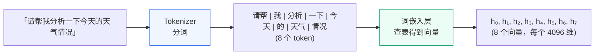

**规律**：中文大约 1~2 个汉字 = 1 个 token，英文约 4 个字母 = 1 个 token。

每个 token 经过词嵌入层后变成一个高维向量，记作 **h**（如上图的 h₀…h₇）。它是一个 **d 维的数字数组**（实际模型里 d 常为 4096，即 4096 个浮点数；本文为方便演示统一简化成 4 维）。这些 h 向量就是后续所有计算的起点。

::: warning 但这串向量有个致命缺陷：彼此孤立
此刻「天气」的向量只编码了**"天气"这个词本身**，它并不知道：

- 前面有「今天」——少了时间限定
- 整句话是在「询问」——少了意图

**而缓存要缓存的，恰恰是下一步"消除孤立"时产生的中间结果。** 所以要讲清楚缓存存了什么，必须先看模型如何让这些孤立向量"互相参考"——这就是第三章的注意力机制。
:::

---

## 三、注意力机制：Q、K、V 的本质

> **承接上一章**：我们已经拿到一串彼此孤立的向量，本章就来看模型如何用 Q/K/V 让它们互相关联。这是理解缓存的核心——搞懂了这一步，后面的缓存全是水到渠成。

### 3.1 为什么需要注意力？

单独看一个 token 的向量，它只知道"我是谁"，不知道"我在什么语境下"。注意力机制的作用就是让每个 token **去参考其他所有 token**，从而获得上下文感知能力。

那它具体怎么"参考"？这里用一个贯穿全文的类比来理解。

::: tip 🔑 核心类比：在图书馆找书（请记住它，后文反复用到）
你想查一个问题，于是拿着**关键词**走进图书馆：

1. 你手里的关键词 = **Q**（你想找什么）
2. 每本书书脊上的**标签** = **K**（这本书能被什么关键词找到）
3. 书里的**实际内容** = **V**（找到后真正读取的东西）

你拿关键词(Q)逐一比对每本书的标签(K)，越匹配的书权重越高，最后把这些书的内容(V)按权重综合起来——这就是一次注意力计算。
:::

### 3.2 Q、K、V 三个角色

回到第二章命名的向量 `h`。每个 token 的 `h` 通过三个不同的矩阵（`Wq`/`Wk`/`Wv`，都是模型训练学到的参数）投影，得到三个不同用途的向量：

```
Q = h × Wq    ← Query（查询）：「我想找什么？」
K = h × Wk    ← Key（索引）：「我能提供什么？」
V = h × Wv    ← Value（内容）：「找到我之后，读取这个」
```

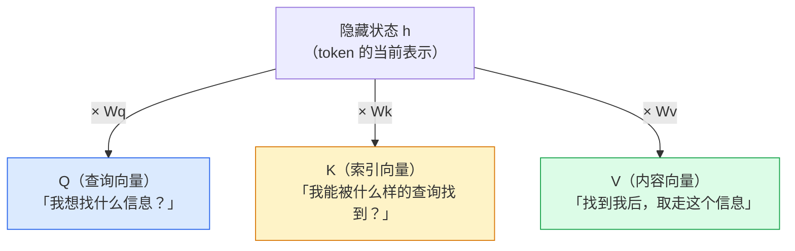

**图书馆类比**（贯穿全文）：

| 角色 | 类比 | 用途 |
|------|------|------|
| Q | 你手里的搜索关键词 | 发起查询 |
| K | 每本书封面的标签/摘要 | 被搜索、被匹配 |
| V | 书里的实际内容 | 匹配成功后读取的信息 |

### 3.3 K、V 为什么要分开？Q 又为什么特殊？

Q/K/V 都从同一个 h 投影而来，但它们的"命运"完全不同。这里有两个关键问题——**第二个问题正是后文 KV Cache 的伏笔，请留意。**

**问题一：K 和 V 为什么要拆成两个向量？**

一句话答案：**"容易被找到"和"找到后读取的内容"是两件不同的事。**

以 token「天气」为例，它的 K 和 V 各司其职：

| | K（索引向量） | V（内容向量） |
|---|---|---|
| 示例值 | `[0.9, 0.1, 0.8, 0.2]` | `[0.3, 0.7, 0.5, 0.6]` |
| 编码什么 | 「我是名词、是气象领域词」 | 「天气的语义细节、情感色彩」 |
| 作用 | 让「天气」**容易被查到** | 被查到后**实际传递的语义** |
| 图书馆类比 | 书脊上的标签 | 书里的内容 |

若强行让 K=V，就等于规定"书脊标签"必须和"整本书内容"一模一样——标签便失去了"便于检索"的意义。拆开后，K 专注于"好检索"、V 专注于"信息全"，两者各自独立优化。

**问题二：Q 为什么不和 K/V 并列讨论？**

因为 **Q 是"当下发问者"，K/V 是"被查阅的历史档案"**，角色根本不同：

| 向量 | 属于谁 | 何时用 | 会被复用吗 |
|------|--------|--------|-----------|
| **Q** | 当前正在生成的新 token | 只在这一步发起一次查询 | ❌ 用完即弃 |
| **K / V** | 所有历史 token | 被当前及未来每一步反复查询 | ✅ 值得留存 |

::: tip 🔑 埋个伏笔
正因为 K/V 会被未来每一步反复查询、而 Q 用一次就丢，所以模型只把 **K 和 V** 存起来复用——这就是第六章「**KV** Cache」名字的由来（不是 QKV Cache）。记住这个区别，后面会反复用到。
:::

### 3.4 注意力计算：完整四步

公式：`Attention(Q, K, V) = softmax( Q · Kᵀ / √d ) · V`

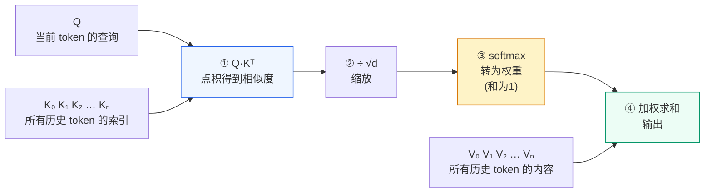

用大白话说：
1. 当前 token 的 Q 与所有历史 token 的 K 逐一比对 → 得到"跟谁最相关"的分数
2. 缩放防止数值爆炸
3. softmax 把分数变成权重（加起来等于 1）
4. 用权重对所有 V 加权求和 → 得到融合了上下文的输出

::: details softmax 在这里到底做了什么？（可选展开）
点积得到的原始分数（如 `[0.285, 0.170, 0.335]`）有两个问题：可能是负数、加起来也不等于 1，没法直接当"权重"用。softmax 做两件事：

1. **取指数 `eˣ`**：把任意实数变成正数，并放大差距（分数高的更突出）
2. **归一化**：每个除以总和，让所有结果加起来正好 = 1

这样输出就成了一组合法的"占比"——可以直接理解为"当前 token 该把多少注意力分给每个历史 token"。本文不必深究公式，记住"分数 → 一组和为 1 的权重"即可。
:::

### 3.5 数值走读：3 个 token 完整算一遍

假设输入「我 爱 猫」（3 个 token），模型只有 **1 层**，向量维度 d=4。

**Step 1：词嵌入后得到 h 向量**

```
h₀("我")  = [1.0, 0.0, 0.5, 0.2]
h₁("爱")  = [0.3, 0.9, 0.1, 0.7]
h₂("猫")  = [0.8, 0.2, 0.9, 0.4]
```

**Step 2：通过 Wq/Wk/Wv 投影（简化为缩放示意）**

```
token "我":  Q₀=[0.5,0.0,0.3,0.1]  K₀=[0.8,0.1,0.4,0.2]  V₀=[0.2,0.6,0.1,0.9]
token "爱":  Q₁=[0.2,0.5,0.1,0.4]  K₁=[0.3,0.7,0.1,0.5]  V₁=[0.7,0.3,0.8,0.2]
token "猫":  Q₂=[0.4,0.1,0.5,0.2]  K₂=[0.6,0.2,0.7,0.3]  V₂=[0.5,0.4,0.6,0.7]
```

**Step 3：计算 token "猫" 对前面所有 token 的注意力**

```
Q₂ · K₀ᵀ = 0.4×0.8 + 0.1×0.1 + 0.5×0.4 + 0.2×0.2 = 0.57
Q₂ · K₁ᵀ = 0.4×0.3 + 0.1×0.7 + 0.5×0.1 + 0.2×0.5 = 0.34
Q₂ · K₂ᵀ = 0.4×0.6 + 0.1×0.2 + 0.5×0.7 + 0.2×0.3 = 0.67

缩放(÷√4=÷2): [0.285, 0.170, 0.335]
softmax:       [0.33,  0.28,  0.39]   ← 注意力权重
```

**Step 4：加权求和得到输出**

```
output₂ = 0.33 × V₀ + 0.28 × V₁ + 0.39 × V₂
         = 0.33×[0.2,0.6,0.1,0.9] + 0.28×[0.7,0.3,0.8,0.2] + 0.39×[0.5,0.4,0.6,0.7]
         = [0.45, 0.39, 0.49, 0.63]
```

::: tip 小结
「猫」的输出向量融合了"我"（权重 0.33）、"爱"（权重 0.28）和"猫"自身（权重 0.39）的信息。这就是注意力机制让模型理解上下文的方式。
:::

---

## 四、多层 Transformer：逐层深化理解

> **承接上一章**：3.5 的走读为了好懂，假设模型只有 **1 层**。但真实模型是几十上百层串联，而这一点直接决定了 KV Cache 必须"分层存储"——所以在讲缓存之前，必须先理解多层结构。

实际模型不是只有 1 层，而是 32~128 层串联。每一层都做一遍完整的注意力计算，但**看到的东西越来越深**。

### 4.1 层与层之间：信息逐步抽象

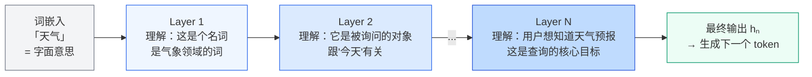

**关键：每一层的输入不同，所以每一层算出的 K/V 也完全不同。**

- Layer 1 的 K/V：基于字面意思算出的索引/内容
- Layer 2 的 K/V：基于"理解了语法关系之后"算出的索引/内容
- Layer N 的 K/V：基于"理解了整体意图之后"算出的索引/内容

### 4.2 为什么每层的 K/V 不同？两个原因

**原因一：输入不同**

Layer 2 的输入是 Layer 1 的输出（已经融合了上下文），不再是原始的词嵌入。

**原因二：参数矩阵不同**

每层有自己独立的 Wk 和 Wv。即使假设输入相同，乘以不同矩阵也会得到完全不同的结果：

```
Layer 1:  h × Wk₁ → K₁ = [0.3, 0.6, 0.2, 0.7]   ← 字面语义的索引
Layer 2:  h'× Wk₂ → K₂ = [0.5, 0.1, 0.8, 0.4]   ← 上下文关系的索引
Layer 3:  h"× Wk₃ → K₃ = [0.9, 0.7, 0.3, 0.6]   ← 任务意图的索引
```

**这就是为什么 KV Cache 必须分层存储——每层的 K/V 代表不同层次的理解，不可互相替代。**

### 4.3 h 向量的流转与最终输出

每一层产出一个新的隐藏状态 h，传递给下一层。最终只有**最后一层的 hₙ** 被用来预测下一个 token：

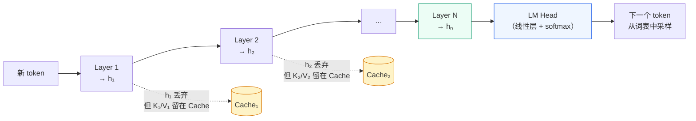

::: tip 小结
中间层的 h 算完就丢，但每一层产生的 K/V 会永久存入该层的 Cache。这样下一个新 token 进来时，就不用重新计算历史 token 在每一层的 K/V 了。
:::

---

## 五、多头注意力与 GQA：缓存大小的关键

前面讲的注意力机制只有"一组" Q/K/V。实际模型并行跑多组，称为 **Multi-Head Attention（多头注意力）**。

### 5.1 为什么需要多头？

单组注意力只能捕捉一种语义关系。多头并行，每个头独立学习不同维度的关注模式：

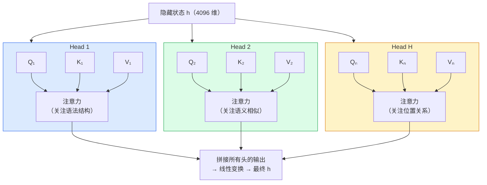

每个头的维度 = 总维度 / 头数。以 4096 维、32 头为例，每头维度 = 128。

**对 KV Cache 的影响**：Cache 需要保存每一层每一头的 K/V，实际存储量 = 层数 × 头数 × token 数 × 2。

### 5.2 GQA：压缩 Cache 大小的工程优化

**Multi-Head Attention 的问题**：每个头都有独立的 K/V，Cache 随头数线性增长。对于长上下文，显存压力极大。

**GQA（Grouped Query Attention，分组查询注意力）** 的解法：让多个 Q 头**共享**同一组 K/V 头。

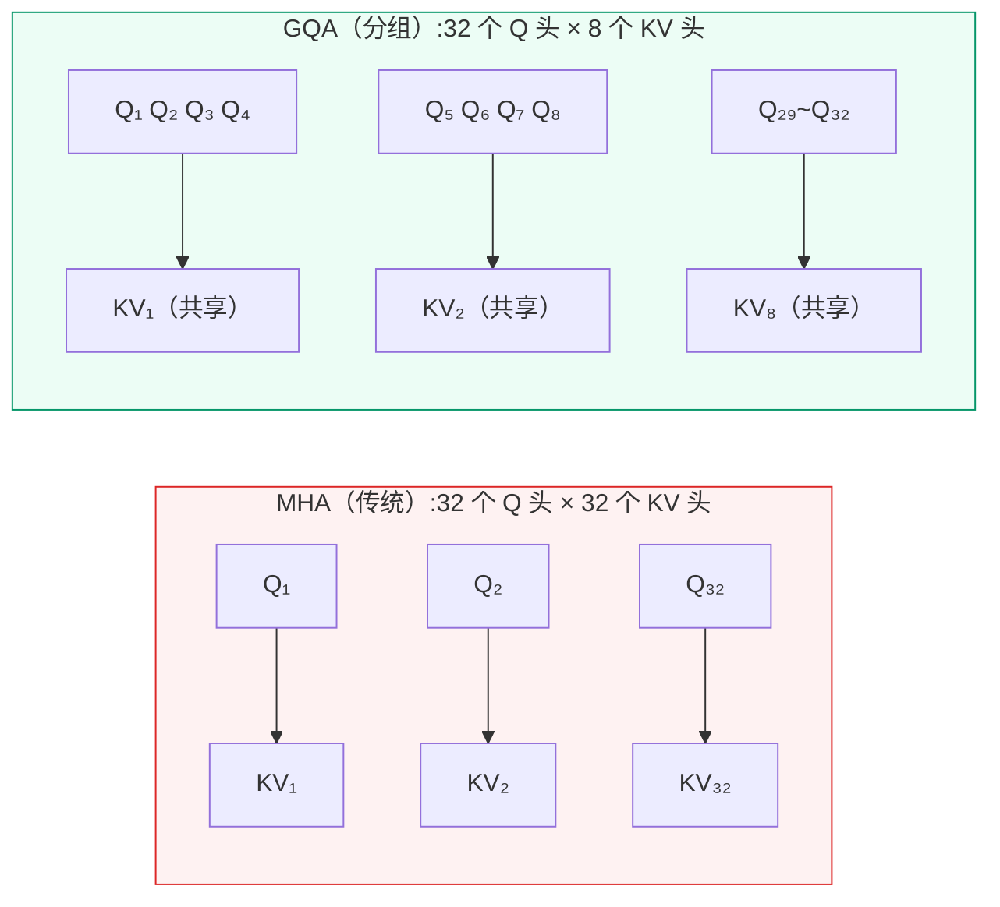

**效果**：KV Cache 大小缩减为原来的 **1/4**（32 头 → 8 头），推理速度更快，显存占用更低。

主流模型的选择：

| 模型 | 注意力类型 | KV 头数 | Q 头数 |
|------|-----------|--------|--------|
| GPT-3 | MHA | 96 | 96 |
| Llama 2 70B | GQA | 8 | 64 |
| Llama 3 70B | GQA | 8 | 64 |
| DeepSeek-V3 | MLA* | 1（压缩） | 128 |

> \* DeepSeek-V3 使用了更激进的 **MLA（Multi-head Latent Attention）**，将 K/V 压缩到单个低秩向量再展开，Cache 大小进一步大幅压缩。

::: tip 小结
MHA = 多组 Q/K/V 并行，捕捉多维度语义关系，但 Cache 大。GQA = Q 头多、KV 头少，多个 Q 共享 KV，Cache 缩减 4~8 倍，是现代大模型的主流选择。
:::

---

## 六、KV Cache：请求内的加速引擎

> **承接上一章**：第三~五章已经讲清了注意力机制、多层结构、以及多头/GQA 如何决定 K/V 的存储规模。所有铺垫就绪——KV Cache 要存的，正是前面反复出现的"每层每头的 K/V"。

现在你已经理解了 K/V 的来历和规模，KV Cache 的原理就很直观了。

### 6.1 没有缓存时的浪费

生成第 100 个 token 时，需要拿它的 Q 去跟前面 99 个 token 的 K 比对。如果没有缓存，那这 99 个 token 的 K/V 在每一层都要**重新算一遍**：

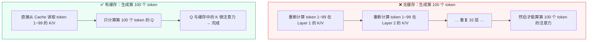

**计算量对比**（以 1024 个 token、32 层为例）：

| | 无缓存 | 有缓存 |
|--|--------|--------|
| 每步计算量 | O(n²) | O(n) |
| 生成 1024 token 总量 | ~5.4 亿次乘法 | ~0.67 亿次乘法 |
| 节省 | — | **约 87%** |

### 6.2 两个阶段：Prefill 与 Decode

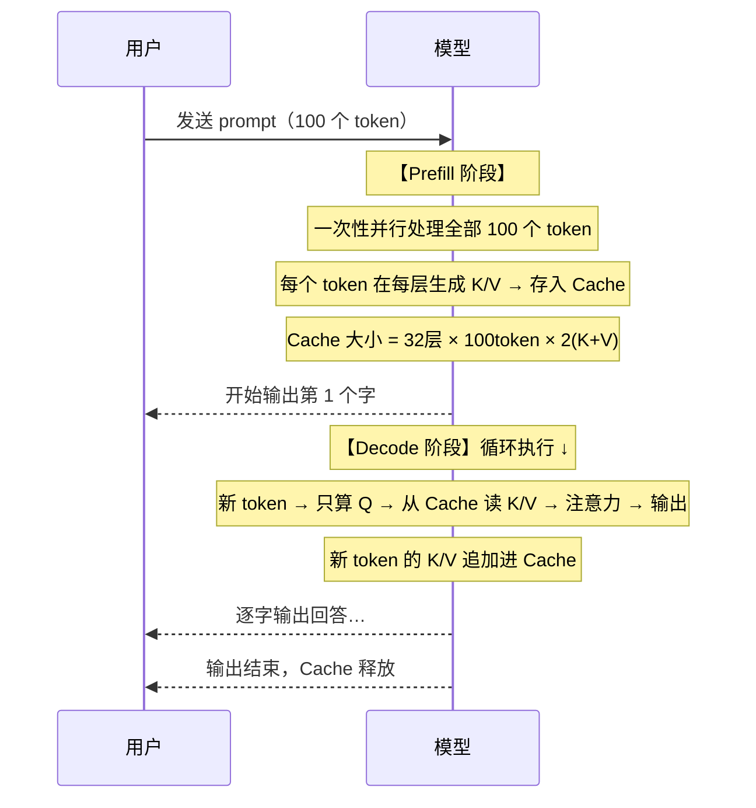

| 阶段 | 做什么 | 特点 |
|------|--------|------|
| Prefill | 并行处理所有输入 token，建立 Cache | 一次性完成，计算密集 |
| Decode | 每步只算 1 个新 token 的 Q | 利用 Cache，速度快 |

### 6.3 命中缓存时发生了什么？

这里有个常见误解：「命中缓存是去选中某一层吗？」

**不是。每一层都独立维护自己的 Cache，每一层都在同时命中。**

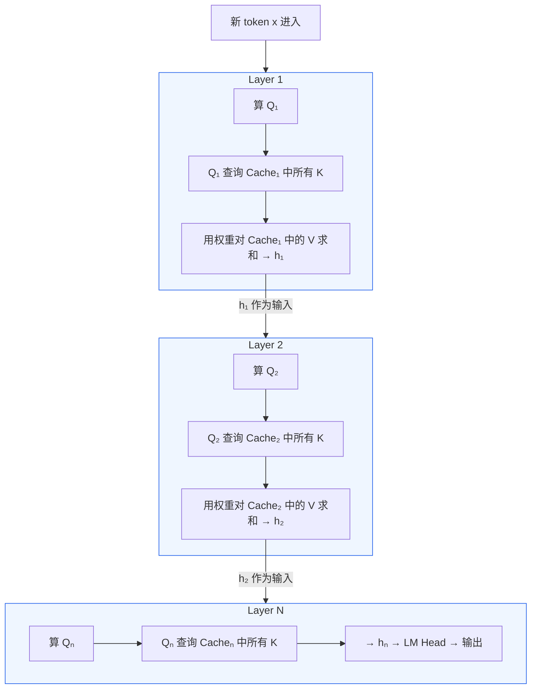

所谓"命中缓存"就是：历史 token 的 K/V 已经在 Prefill 阶段全部算好存着了，Decode 时每一层直接读取，跳过重新计算。

### 6.4 Cache 的存储结构

一个 32 层模型，处理了 100 个 token 后，Cache 中存储的数据：

```
Cache 总量 = 32层 × 100个token × 2(K和V) = 6400 个向量
每个向量 = 4096 维 × 2字节(fp16) = 8KB
总占用 ≈ 6400 × 8KB ≈ 50MB
```

对于 128K 上下文的长对话，Cache 可能占到 **数 GB 的 GPU 显存**。这也是为什么长对话成本更高。

::: tip 小结
KV Cache 的本质：在 Prefill 阶段把所有历史 token 的 K/V 算好存起来，Decode 时直接查表，避免重复计算。代价是 GPU 显存占用。
:::

---

## 七、Prompt Cache：跨请求的加速

KV Cache 在请求结束时就会被释放。但如果下一次请求的 prompt 前缀和上一次一样呢？Prompt Cache 就是解决这个场景的。

### 7.1 多轮对话的真相：模型没有记忆

模型本身**不记得**之前聊过什么。多轮对话能"延续"，是因为客户端每次都把**完整历史**拼在一起发给模型：

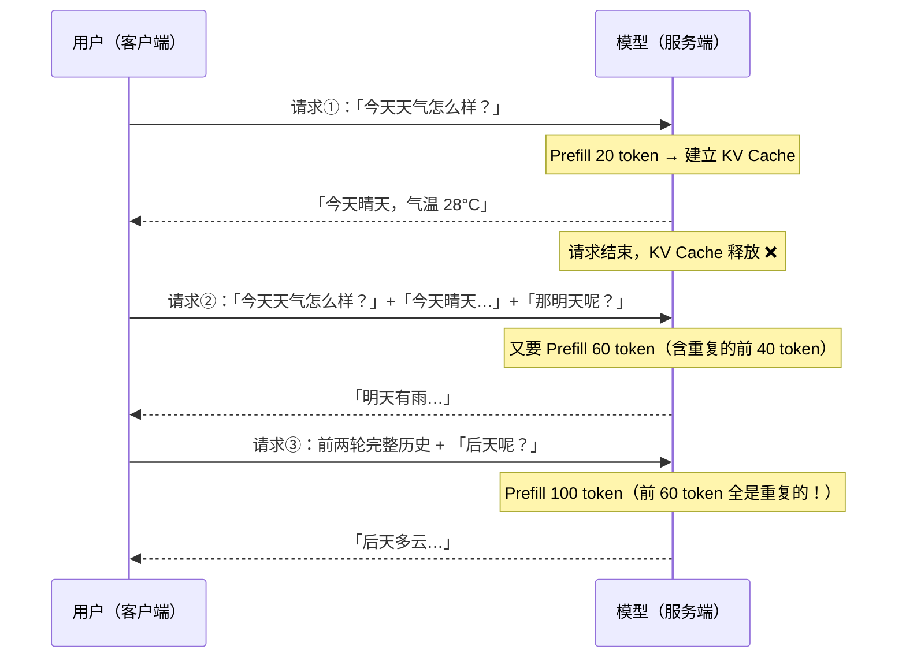

**问题**：每次请求的 prompt 前缀都是重复的，但 KV Cache 已经释放了，只能重新算。这就是 Prompt Cache 要解决的浪费。

### 7.2 Prompt Cache 原理

Prompt Cache 把 Prefill 阶段的结果**持久化**保存（存到服务器磁盘/内存），下次请求如果前缀匹配就直接复用：

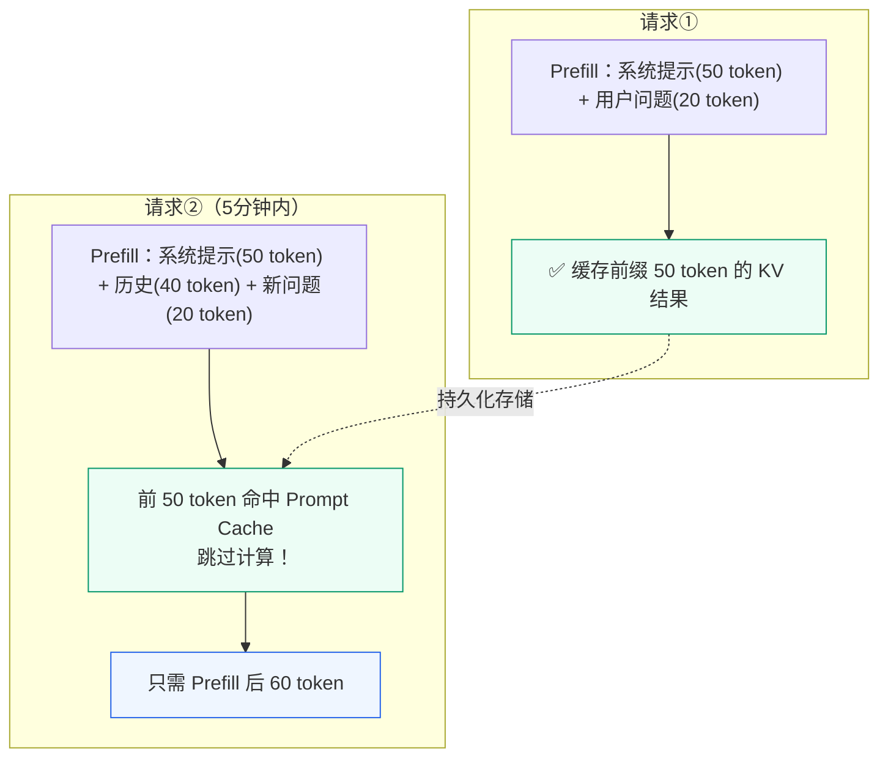

### 7.3 命中条件：前缀必须严格一致

Prompt Cache 采用**前缀匹配**，从第一个 token 开始逐一比对，一旦发现不同就停止：

```
请求①的 prompt: [A B C D E F G]
                         ↑ 缓存了前 7 个 token 的 KV

请求②的 prompt: [A B C D E F G H I J]
                 ✅ 前 7 个匹配 → 命中！只需新算 H I J

请求③的 prompt: [A B X D E F G H]
                     ↑ 第 3 个就不同 → 只命中 A B，其余全部重算
```

**实践含义**：
- ✅ System Prompt 放最前面，保持不变 → 每次都能命中
- ❌ 在 System Prompt 里插入时间戳或随机 ID → 每次都缓存失效

### 7.4 两种缓存的完整对比

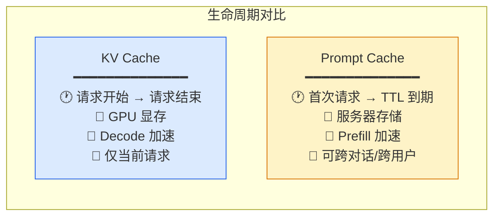

| 维度 | KV Cache | Prompt Cache |
|------|----------|-------------|
| 存什么 | 各层 K/V 矩阵 | 各层 K/V 矩阵（相同） |
| 何时建立 | 每次 Prefill | 首次请求时 |
| 何时释放 | 请求结束 | TTL 到期（分钟~小时级） |
| 谁受益 | 当前请求的 Decode 阶段 | 后续请求的 Prefill 阶段 |
| 作用范围 | 单请求 | 可跨对话、甚至跨用户 |

### 7.5 各平台 Prompt Cache 策略对比

| 平台 | Prompt Cache 触发方式 | TTL | 命中后折扣 | 备注 |
|------|----------------------|-----|-----------|------|
| **Anthropic Claude** | 手动标记 `cache_control` | 5 分钟 | Input token 降至 **1/10** | 需显式在 API 中开启，标记位置灵活 |
| **OpenAI GPT** | 自动（prompt > 1024 token） | ~1 小时 | Input token 约 **5 折** | 无需任何配置，对开发者最友好 |
| **Google Gemini** | 手动，TTL 可自定义 | 分钟～数小时 | 按存储时长单独计费 | 最灵活但也最复杂，需权衡存储成本 |
| **DeepSeek** | 自动前缀匹配 + disk cache | 未公开 | 命中后大幅降价 | disk cache 对长上下文尤为友好 |
| **SiliconFlow** | 自动前缀匹配 | 未公开 | 命中后节省计算 | 无需配置，兼容 OpenAI 接口 |
| **Qwen（阿里百炼）** | 自动前缀匹配 | 未公开 | 命中后节省计算 | 无需配置 |

**选型建议**：
- 短对话、一般场景 → OpenAI GPT（自动缓存，零配置）
- 长 System Prompt / RAG → Claude（手动开启但折扣最大，1/10）
- 长上下文反复查询 → DeepSeek（disk cache 成本极低）
- 需要精确控制 → Gemini（自定义 TTL）

::: tip 小结
Prompt Cache = KV Cache 的持久化版本。两者存储的内容完全相同（每层的 K/V 矩阵），区别只在生命周期和作用范围。
:::

---

## 八、开发实践建议

### 8.1 让 System Prompt 稳定且足够长

Prompt Cache 的命中率直接取决于前缀的稳定性。

```
✅ 正确做法：
[固定的 System Prompt (2000 token)]  +  [对话历史]  +  [新问题]
                                       ↑ 这部分每次都能命中缓存

❌ 错误做法：
[System Prompt + 当前时间戳 + 用户ID]  +  [对话历史]  +  [新问题]
                ↑ 每次都不同，导致整个缓存失效
```

### 8.2 对话历史只追加不修改

已有的历史消息不要重排、删除或修改内容。任何改动都会让改动位置之后的所有 Prompt Cache 失效。

### 8.3 Claude 用户需手动开启缓存

```json
{
  "system": [
    {
      "type": "text",
      "text": "你是一个专业的技术文档助手…（很长的 system prompt）",
      "cache_control": { "type": "ephemeral" }
    }
  ],
  "messages": [
    { "role": "user", "content": "请帮我分析这段代码" }
  ]
}
```

标记了 `cache_control` 的部分会被缓存 5 分钟，命中后 Input token 成本降到 **1/10**。

### 8.4 长对话要做历史压缩

由于每次请求都要发送完整历史，token 消耗随轮次线性增长。建议超过一定轮数后做摘要压缩：

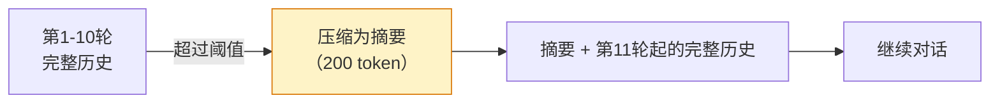

### 8.5 长上下文任务优先考虑 DeepSeek

对于代码库分析、长文档反复查询等场景，DeepSeek 的 disk cache 层在命中后价格极低，是长上下文场景的成本优先选项。

### 8.6 统一排版：稳定内容前移，动态内容后置

8.1 只说了"别在 System Prompt 里塞时间戳"，但真实请求里还有 **tools 定义、few-shot 示例**，它们同样属于稳定前缀。一条通用原则能覆盖所有情况：**把"每次都一样"的内容全部放前面，把"每次都不同"的内容全部放最后。**

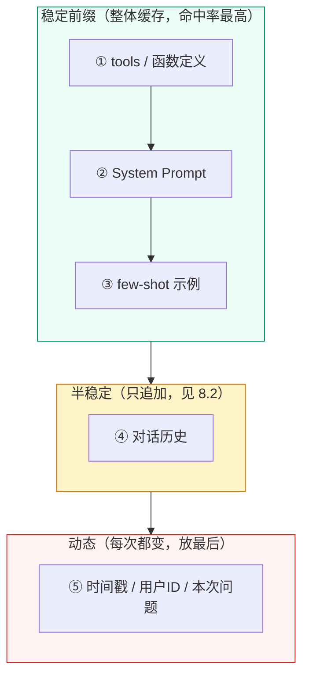

**为什么动态内容必须放最后？** 因为前缀匹配是从第一个 token 顺序比对的（7.3）。哪怕只在中间插一个变动的时间戳，它**之后**的所有内容都会被判为"不一致"而全部重算。放到最末尾，变动只影响它自己，前面一长串照样命中。

::: tip Claude 可以打多个缓存断点
8.3 只演示了一个 `cache_control`，实际可以在 **tools 之后、System 之后**各打一个断点。这样即使你偶尔只改动 few-shot，tools 和 System 那两段更靠前的缓存依然有效，不会整体失效。
:::

### 8.7 验证缓存是否真的命中

前面都是"怎么做"，但配好之后必须能**确认它真的生效了**。各家 API 的响应里都带了缓存字段，直接看数字即可：

| 平台 | 看哪个字段 | 含义 |
|------|-----------|------|
| **Claude** | `cache_read_input_tokens` | 命中并复用的 token 数（> 0 即命中） |
| **Claude** | `cache_creation_input_tokens` | 首次写入缓存的 token 数（第一次请求才有） |
| **OpenAI** | `usage.prompt_tokens_details.cached_tokens` | 命中的 token 数 |
| **DeepSeek** | `prompt_cache_hit_tokens` / `prompt_cache_miss_tokens` | 命中 / 未命中的 token 数 |

以 Claude 的响应为例：

```json
{
  "usage": {
    "input_tokens": 30,
    "cache_creation_input_tokens": 0,
    "cache_read_input_tokens": 2000,   // ← 命中！复用了 2000 token 的前缀
    "output_tokens": 120
  }
}
```

**怎么判断**：
- 第一次请求：`cache_creation` 大、`cache_read` 为 0 —— 正在建缓存，正常。
- 后续请求：`cache_read` 大、`input_tokens` 很小 —— 命中成功，省钱了。
- 后续请求 `cache_read` 始终为 0 —— 没命中，回头检查前缀是否被动态内容污染（8.1 / 8.6）。

::: warning 命中率要持续监控，而非配一次就不管
prompt 模板、tools 定义一旦改版，缓存就会整体失效。建议把 `cache_read` 占比做成线上指标，命中率突然掉到 0 往往意味着某次发布动了前缀。
:::

### 8.8 用保活请求避免缓存过期

Prompt Cache 有 **TTL（存活时间）**，过期后缓存被清掉，下次请求又得全量重算（等于冷启动）。各家时效差别很大（见 7.5），其中 Claude 默认只有 **5 分钟**，最容易过期。

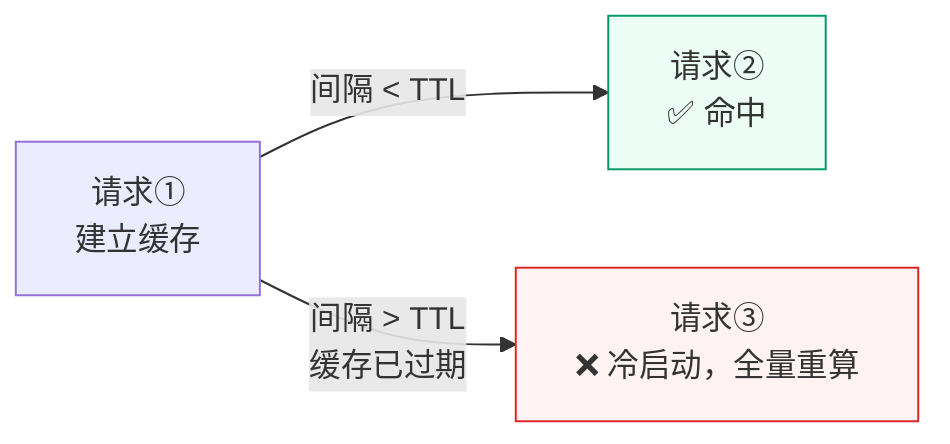

**应对策略**：
- **高频场景**：请求本就密集，TTL 内自然有下一次请求续上，无需特殊处理。
- **稀疏但延迟敏感**：可在 TTL 临到期前发一个轻量"保活"请求，让缓存持续刷新。但要算账——保活本身也花钱，只有当"重建缓存的成本 > 保活成本"时才划算。
- **Claude 长缓存选项**：若间隔稳定大于 5 分钟，可评估 Claude 的 **1 小时延长 TTL**（按更高的存储价计费），用存储成本换命中率。

::: tip 小结
8.6 决定缓存**能不能命中**（排版），8.7 确认它**有没有命中**（监控），8.8 保证它**别过早失效**（保活）。配置、验证、保活三步齐全，缓存优化才算闭环。
:::

---

## 总结：一张图看懂全貌

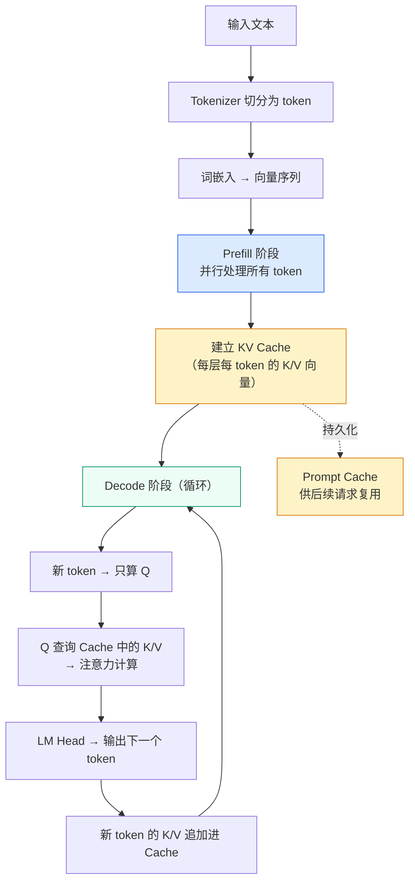

**核心要点回顾**：

1. 每个 token 通过 Wq/Wk/Wv 三个矩阵得到 Q/K/V 三个向量，各有不同用途
2. K 是"索引"用于被找到，V 是"内容"被找到后读取——这就是为什么它们分开存
3. 每层有独立参数，所以每层的 K/V 都不同，Cache 必须分层存储
4. KV Cache 避免 Decode 阶段的重复计算（请求内有效）
5. Prompt Cache 避免 Prefill 阶段的重复计算（跨请求有效）
6. 开发时保持 prompt 前缀稳定，就能最大化缓存命中率
